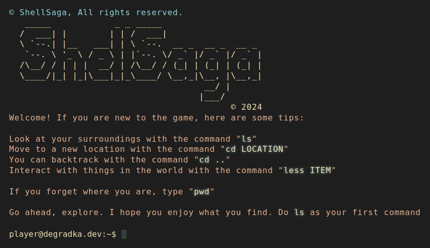

# ShellSaga

Welcome to ShellSaga, your gateway to mastering the bash terminal in a unique and entertaining way!

## What is ShellSaga?

ShellSaga is an interactive text adventure platform designed to teach IT enthusiasts and students the ins and outs of the bash terminal. Say goodbye to traditional, boring learning methods – embrace the learning by doing!

*Inspired by Terminus (MIT).*

## About

- **Engaging Text Adventures:** Get ready for a ride as you immerse yourself in scenarios that walk you through practical bash terminal exercises.
- **User-Friendly Interface:** Navigate seamlessly with our intuitive terminal-like design crafted using only HTML, Javascript, and CSS.
- **Open Source:** We're all about collaboration. ShellSaga is open-source, and we're throwing the doors wide open for the community to join in on the development.
- **GitHub Pages Hosting:** Jump in hassle-free – the party is right there on the repository!

## Ready to Roll?

1. Open [ShellSaga](https://yourusername.github.io/shellsaga/) in your favorite web browser.
2. Enjoy!

## Contributing

I'm all ears for your contributions! Found a bug? Want to add new adventures? Or maybe you're itching to spice up the interface? Your input is gold!

## Feedback

Have ideas or feedback? Open an [issue](https://github.com/yourusername/ShellSaga/issues) – we'd love to hear from you!

## License

ShellSaga is licensed under the [GPL v3 License](LICENSE).

---

**Ready to dive into your ShellSaga adventure? Buckle up and let's explore the exciting world of bash terminal learning together! 🌐✨**
